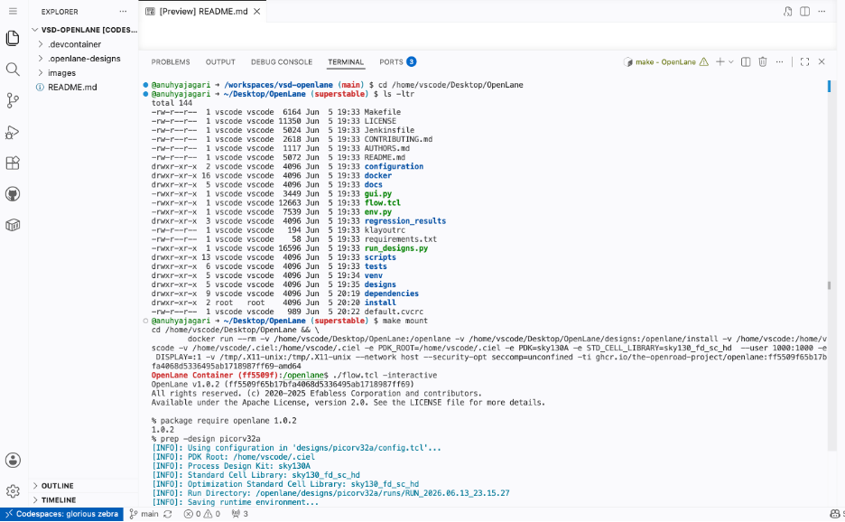
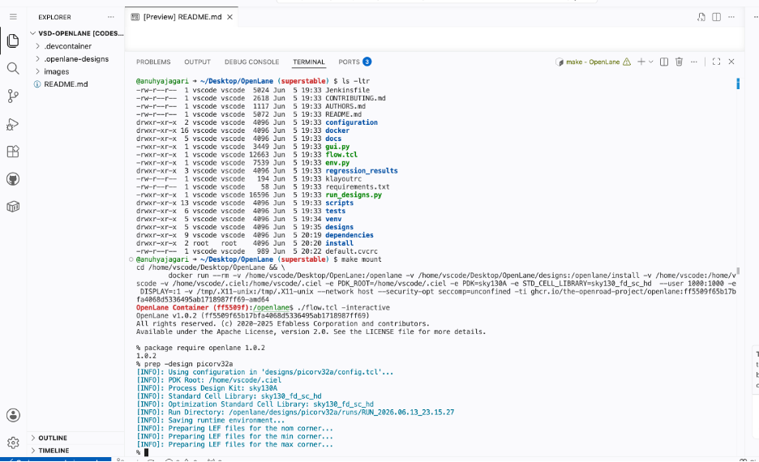
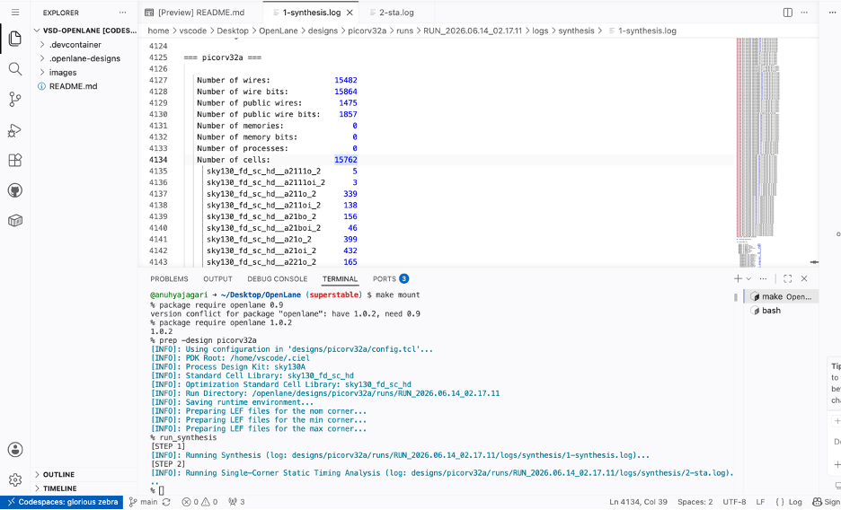
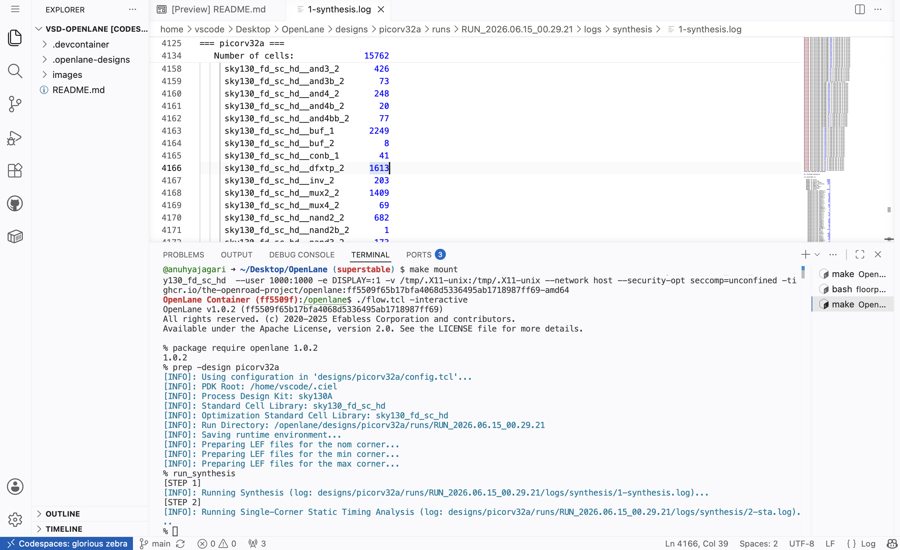

## Soc-Design-and-Planning-VSD
RTL-to-GDSII Physical Design Flow using OpenLane and Sky130 PDK.

## Digital VLSI SoC Design and Planning — RTL to GDSII

This repository contains my notes, lab exercises, screenshots, and learnings from the Digital VLSI SoC Design and Planning Workshop conducted by VSD (VLSI System Design).

---

## Day 1 – Introduction to Open-Source EDA, OpenLANE and Sky130 PDK

### Topics Covered
* Introduction to ASIC Design Flow
* Understanding Chip Components
* RISC-V ISA Basics
* RTL to GDSII Flow
* Open-Source EDA Ecosystem
* Introduction to Sky130 PDK
* OpenLANE ASIC Flow
* Hands-on Synthesis using OpenLANE

---

## 1. Where is a Chip Located & Understanding its Components

### Chip Location
Before diving into the internal architecture, it is essential to understand where the chip resides. A finalized integrated circuit (IC) or chip package is surface-mounted directly onto a **PCB (Printed Circuit Board)**. The PCB contains copper tracks that route electrical power and communication signals between the chip pins and other peripheral components on the system board.

### Inside the Chip

| Component | Description |
|------------|------------|
| **Die** | The actual silicon piece containing the complete circuit. |
| **Core** | Area where standard cells, logic gates, and digital circuitry are placed. |
| **Pads** | Interface between internal circuitry and external pins. |
| **Macros** | Large pre-designed blocks such as SRAMs, PLLs, and processors. |
| **IPs** | Reusable and pre-verified functional blocks. |
| **Foundry** | Semiconductor company responsible for manufacturing the chip. |


## 2. RISC-V ISA: From Software to Physical Layout

A software application eventually becomes hardware through several abstraction levels.

```text
C Program
    ↓
Compiler
    ↓
Assembly Code
    ↓
Assembler
    ↓
RISC-V Machine Instructions
    ↓
RTL (Verilog)
    ↓
Netlist
    ↓
Physical Layout
```

### Flow Explanation

- **C Program** → High-level code written by the programmer.
- **Compiler** → Converts C code into assembly instructions.
- **Assembler** → Converts assembly instructions into binary machine code.
- **RISC-V Instructions** → Instructions understood and executed by the processor.
- **RTL (Verilog)** → Hardware description of the processor architecture.
- **Netlist** → Gate-level representation generated after synthesis.
- **Physical Layout** → Final placement of transistors and metal layers on silicon.

---

## 3. Components Required for Open-Source ASIC Design

To successfully execute an automated open-source digital design flow, three fundamental pillars must be present:

### 1. RTL Design
The hardware description code (Verilog) defining the logic and behavior of the target design.

### 2. EDA Tools
Open-source automated software suites used for synthesis, placement, routing, and physical sign-off verification. 
* *Examples:* OpenLANE, OpenROAD, Yosys, Magic, Netgen.

### 3. PDK (Process Design Kit)
The collection of files that links software tools to a real manufacturing foundry. It contains:
* Design rules (DRC, LVS)
* Device simulation models
* Standard Cell Libraries (SCL)
* Timing and physical layer information
* *Workshop PDK:* **Sky130 Open-Source PDK**

---

## 4. RTL to GDSII Flow

### RTL

Describes the functionality of the design using Verilog.

### Synthesis

Converts RTL into a gate-level netlist using standard cells.

### Floorplanning

- Defines chip dimensions
- Places macros
- Places I/O pins
- Allocates routing resources

### Power Planning

Creates the Power Distribution Network (PDN).

Purpose:
- Deliver stable power
- Reduce IR Drop
- Improve reliability

### Placement

Places standard cells inside the core area.

Goal:
- Reduce wire length
- Improve timing

### Clock Tree Synthesis (CTS)

Builds the clock distribution network.

Goal:
- Minimize clock skew
- Balance clock arrival times

### Routing

Creates metal connections between all cells.

Goal:
- Establish complete physical connectivity

### Sign-Off Checks

#### STA (Static Timing Analysis)

Verifies setup, hold, and timing requirements.

#### DRC (Design Rule Check)

Ensures the layout follows foundry design rules.

#### LVS (Layout Versus Schematic)

Verifies that the physical layout matches the logical netlist.

### GDSII

Final layout database sent to the foundry for fabrication.

---

## 5. OpenLANE ASIC Flow Tool Reference Stack

The automated pipeline executes the stages listed above using the following open-source tool implementations:

| Stage | Tool |
| :--- | :--- |
| **RTL Synthesis** | Yosys + ABC |
| **STA (Static Timing)** | OpenSTA |
| **DFT (Design for Test)** | Fault |
| **Floorplanning** | OpenROAD |
| **Placement** | OpenROAD |
| **CTS** | TritonCTS |
| **Routing** | TritonRoute |
| **RC Extraction** | OpenRCX |
| **DRC Verification** | Magic |
| **LVS Verification** | Netgen |
| **GDSII Generation** | Magic |

---

### Lab — Running OpenLANE for picorv32a

#### Setting Up and Invoking OpenLANE

```
cd /home/vscode/Desktop/OpenLane
make mount
./flow.tcl -interactive
package require openlane 1.0.2
```


#### Preparing the Design

```
prep -design picorv32a
```



#### Running Synthesis

```
run_synthesis
```





#### Flop Ratio Calculation

After synthesis completes, the flop ratio can be calculated from the synthesis statistics:

```
Flop Ratio = Number of D Flip Flops / Total Number of Cells
           = 1613 / 15762
           = 0.1023
           = 10.23%
```

